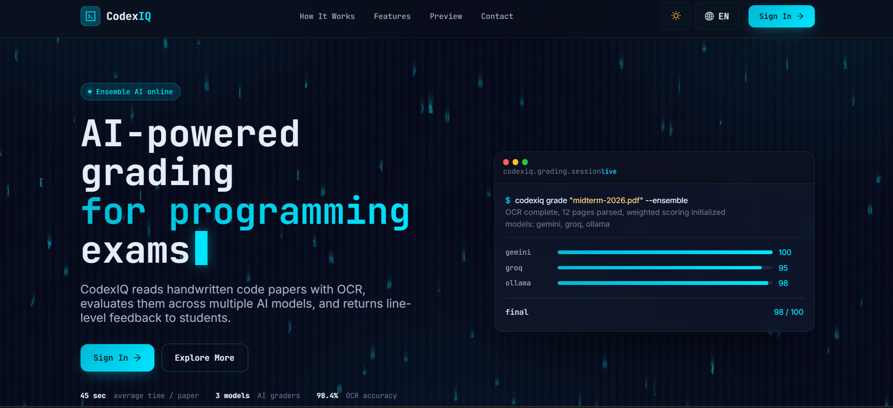
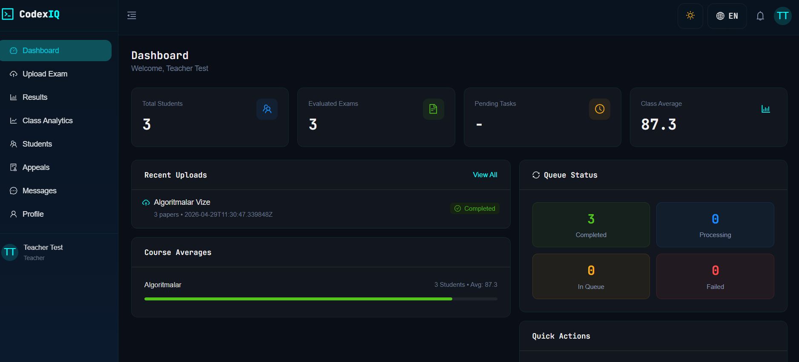
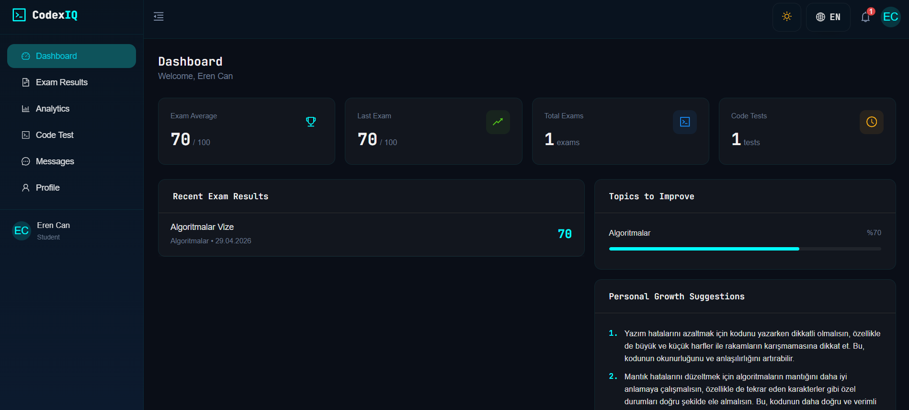
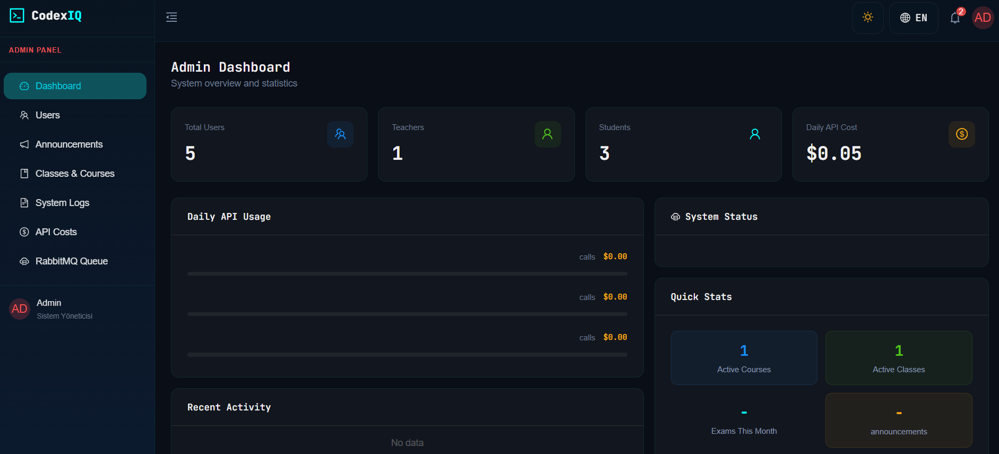
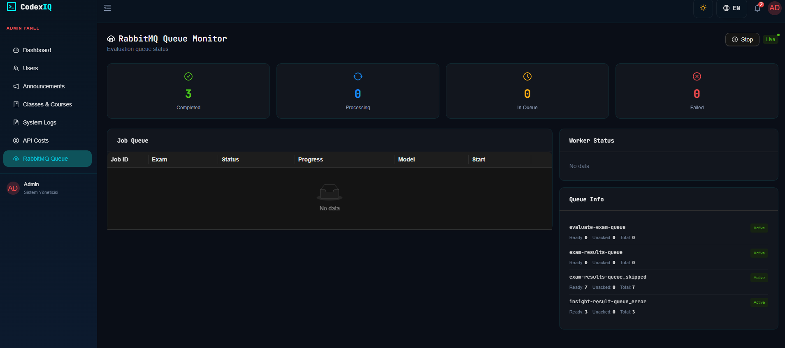
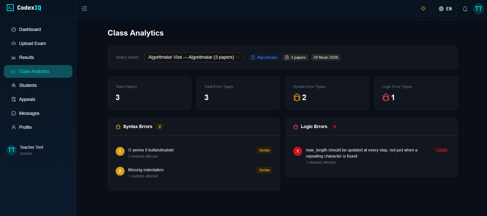
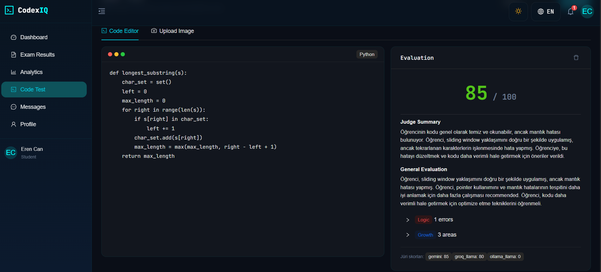

<div align="center">

# CodexIQ

### AI-Powered Programming Exam Grading Platform

[](https://dotnet.microsoft.com/)
[](https://react.dev/)
[](https://python.org/)
[](https://postgresql.org/)
[](https://rabbitmq.com/)

**CodexIQ** is an AI-powered education platform that automatically grades handwritten programming exam papers. Teachers upload scanned exam sheets, three large language models evaluate them in parallel, and results are shared with students.

[Features](#features) · [Architecture](#architecture) · [API Reference](#api-reference) · [Setup](#setup) · [Tech Stack](#tech-stack)

[🇹🇷 Türkçe](README.tr.md)

<br/>



</div>

---

## Overview

Traditional exam grading is time-consuming and burdensome for teachers. CodexIQ fully automates this process:

1. Teacher uploads scanned exam papers to the platform
2. Gemini Vision performs handwriting OCR — extracts student info and code
3. **Gemini**, **Groq Llama** and **DeepSeek** evaluate in parallel as three independent juries
4. A judge model (Groq Llama in JSON mode) synthesizes all three jury verdicts
5. Syntax errors, logic errors, rubric scores and personalized feedback are generated
6. Students view their original paper, score and AI feedback through the platform

---

## Features

### Teacher



- Upload multiple exam papers (PDF auto-split by page + image)
- Define rubric criteria (name + max points per criterion)
- Trigger AI evaluation with a single click
- Manual score override and teacher note per paper
- Share results with students individually or in bulk
- Export results to Excel (CSV) and PDF
- Manage student grade appeal requests
- Student statistics and class-level analytics

### Student



- View shared exam results and scores
- Inspect original scanned exam paper image
- Read detailed syntax and logic error explanations with fix hints
- Submit grade appeal requests
- Personal weak topic analysis
- AI-generated personalized improvement suggestions
- Handwritten code → text OCR tool
- Code execution sandbox
- Real-time messaging with teachers

### Admin

| Admin Dashboard | RabbitMQ Monitoring |
|---|---|
|  |  |

- User management (CRUD, role assignment, active/inactive toggle)
- Class and course management
- Announcement creation and management
- Real-time system log streaming
- API usage cost tracking
- RabbitMQ queue status monitoring

---

## Architecture

```
┌─────────────────────────────────────────────────────────────────┐
│                         CodexIQ Platform                        │
├──────────────┬──────────────────────────┬───────────────────────┤
│  CodexIQ     │     CodexIQ.Api          │   CodexIQ.Frontend    │
│  .Worker     │     (.NET 10 REST API)   │   (React 19 + Vite)   │
│  (Python)    │                          │                        │
│              │  ┌────────────────────┐  │  ┌─────────────────┐  │
│  worker.py   │  │  CodexIQ.Api       │  │  │  Student UI     │  │
│  ┌─────────┐ │  │  (Controllers)     │  │  │  Teacher UI     │  │
│  │Gemini   │ │  ├────────────────────┤  │  │  Admin UI       │  │
│  │Vision   │ │  │  CodexIQ.          │  │  └────────┬────────┘  │
│  │OCR      │ │  │  Application       │  │           │            │
│  └────┬────┘ │  │  (Services/DTOs)   │  │      Axios + SignalR   │
│       │      │  ├────────────────────┤  │           │            │
│  ┌────▼────┐ │  │  CodexIQ.          │◄─┼───────────┘            │
│  │Ensemble │ │  │  Infrastructure    │  │                        │
│  │3x LLM   │ │  │  (EF Core/Auth/   │  │                        │
│  │Parallel │ │  │   MassTransit)     │  │                        │
│  └────┬────┘ │  ├────────────────────┤  │                        │
│       │      │  │  CodexIQ.Domain   │  │                        │
│  ┌────▼────┐ │  │  (Entities/Enums) │  │                        │
│  │ Judge   │ │  └────────┬───────────┘  │                        │
│  │(Hakem)  │ │           │              │                        │
│  └────┬────┘ │      PostgreSQL          │                        │
│       │      │                          │                        │
│  insight_    │  ┌─────────────────────┐ │                        │
│  worker.py   │  │     RabbitMQ        │ │                        │
│              │  │  evaluate-exam-queue│ │                        │
│              │  │  exam-results-queue │ │                        │
│              │  │  generate-insight-q │ │                        │
│              │  │  insight-result-q   │ │                        │
└──────────────┴──┴─────────────────────┴─┴────────────────────────┘
```

### Layer Structure (Clean Architecture)

```
CodexIQ.Domain/          → Entities, Enums (no dependencies)
CodexIQ.Application/     → Interfaces, Services, DTOs, Validators
CodexIQ.Infrastructure/  → EF Core, Repository, Messaging, SignalR, Auth
CodexIQ.Api/             → Controllers, Middleware, Program.cs
CodexIQ.Frontend/        → React 19 + TypeScript (Vite)
CodexIQ.Worker/          → Python AI grading worker
```

| Teacher Analytics | Student Code Test |
|---|---|
|  |  |

### AI Evaluation Flow

```
Exam Paper (PNG/PDF)
        │
        ▼
┌───────────────────┐
│  Gemini Vision    │  ← OCR: Handwriting → Code text + Student name & number
│  (Preprocessed)  │
└────────┬──────────┘
         │
         ▼
┌─────────────────────────────────────┐
│        Parallel Jury Evaluation     │
├───────────┬──────────┬──────────────┤
│  Gemini   │  Groq    │  DeepSeek    │
│  2.5 Flash│  Llama   │  V3 (free)   │
│           │  3.3 70B │              │
└───────────┴──────────┴──────┬───────┘
                               │
                               ▼
                    ┌──────────────────┐
                    │  Judge Model     │  ← Groq Llama (JSON mode)
                    │  Synthesizes     │    Resolves conflicts
                    │  all 3 verdicts  │    Structured output
                    └────────┬─────────┘
                             │
                             ▼
               FinalDecisionReport (JSON)
               ├── total_score: 0-100
               ├── syntax_errors[]
               │   ├── line, description
               │   └── hint (fix suggestion)
               ├── logic_errors[]
               │   ├── why it's wrong
               │   └── correct approach
               ├── growth_areas[]
               └── general_evaluation
```

---

## API Reference

### Auth

| Method | Endpoint | Description |
|--------|----------|-------------|
| `POST` | `/api/auth/login` | Login, returns JWT |
| `PUT` | `/api/auth/change-password` | Change password |

### Admin `/api/admin` — `[Admin]`

| Method | Endpoint | Description |
|--------|----------|-------------|
| `GET` | `/api/admin/dashboard` | System statistics |
| `GET` | `/api/admin/users` | User list (search, role, pagination) |
| `POST` | `/api/admin/users` | Create user |
| `PUT` | `/api/admin/users/{id}` | Update user |
| `DELETE` | `/api/admin/users/{id}` | Delete user |
| `PATCH` | `/api/admin/users/{id}/status` | Toggle active/inactive |
| `GET` | `/api/admin/classes` | Class list |
| `POST` | `/api/admin/classes` | Create class |
| `PUT` | `/api/admin/classes/{id}` | Update class |
| `DELETE` | `/api/admin/classes/{id}` | Delete class |
| `GET` | `/api/admin/classes/{classId}/students` | Class students |
| `POST` | `/api/admin/classes/{classId}/students` | Assign students |
| `DELETE` | `/api/admin/classes/{classId}/students/{studentId}` | Remove student |
| `GET` | `/api/admin/courses` | Course list |
| `POST` | `/api/admin/classes/courses` | Create course |
| `PUT` | `/api/admin/courses/{id}` | Update course |
| `DELETE` | `/api/admin/courses/{id}` | Delete course |
| `GET` | `/api/admin/announcements` | Announcements |
| `POST` | `/api/admin/announcements` | Create announcement |
| `PUT` | `/api/admin/announcements/{id}` | Update announcement |
| `DELETE` | `/api/admin/announcements/{id}` | Delete announcement |
| `GET` | `/api/admin/logs` | System logs |
| `GET` | `/api/admin/api-costs` | API usage costs |
| `GET` | `/api/admin/queue` | Queue status |

### Teacher `/api/teacher` — `[Teacher]`

| Method | Endpoint | Description |
|--------|----------|-------------|
| `GET` | `/api/teacher/stats` | Teacher statistics |
| `GET` | `/api/teacher/courses` | Courses |
| `GET` | `/api/teacher/classes` | Classes |
| `POST` | `/api/teacher/exams` | Create exam |
| `POST` | `/api/teacher/exams/{examId}/papers` | Upload exam papers |
| `POST` | `/api/teacher/exams/{examId}/rubric` | Save rubric |
| `POST` | `/api/teacher/exams/{examId}/start-evaluation` | Start AI evaluation |
| `DELETE` | `/api/teacher/exams/{examId}` | Delete exam |
| `DELETE` | `/api/teacher/papers/{examPaperId}` | Delete paper |
| `GET` | `/api/teacher/results` | Result list (search, filter, pagination) |
| `GET` | `/api/teacher/results/{id}` | Result detail |
| `PUT` | `/api/teacher/results/{id}/override` | Override score |
| `PUT` | `/api/teacher/results/{id}/rubric-scores` | Update rubric scores |
| `PUT` | `/api/teacher/results/{id}/note` | Add teacher note |
| `PUT` | `/api/teacher/results/{id}/share` | Share result |
| `PUT` | `/api/teacher/results/bulk-share` | Bulk share |
| `GET` | `/api/teacher/results/export/excel` | CSV export |
| `GET` | `/api/teacher/results/export/pdf` | PDF export |
| `GET` | `/api/teacher/students` | Student list |
| `GET` | `/api/teacher/students/{id}/stats` | Student statistics |
| `GET` | `/api/teacher/regrade-requests` | Grade appeal requests |
| `GET` | `/api/teacher/regrade-requests/count` | Pending appeal count |
| `POST` | `/api/teacher/regrade-requests/{requestId}/resolve` | Resolve appeal |
| `GET` | `/api/teacher/analytics/exams` | Exam analytics |
| `GET` | `/api/teacher/analytics/top-errors` | Most frequent errors |
| `GET` | `/api/teacher/queue-status` | Evaluation queue status |

### Student `/api/student` — `[Student]`

| Method | Endpoint | Description |
|--------|----------|-------------|
| `GET` | `/api/student/stats` | Student statistics |
| `GET` | `/api/student/results` | Result list |
| `GET` | `/api/student/results/{id}` | Result detail |
| `GET` | `/api/student/results/{id}/paper-image` | Exam paper image |
| `POST` | `/api/student/results/{id}/regrade-request` | Submit grade appeal |
| `GET` | `/api/student/results/{id}/regrade-request` | Appeal status |
| `GET` | `/api/student/weak-topics` | Weak topic analysis |
| `GET` | `/api/student/insight` | Personalized improvement suggestions |
| `GET` | `/api/student/analytics/progress` | Progress analytics |
| `GET` | `/api/student/analytics/error-summary` | Error summary |
| `GET` | `/api/student/announcements` | Announcements |
| `POST` | `/api/student/convert-code` | Handwriting → Text (OCR) |
| `POST` | `/api/student/run-code` | Run code |
| `POST` | `/api/student/join-class` | Join class with code |

### Messages `/api/messages` — `[Authenticated]`

| Method | Endpoint | Description |
|--------|----------|-------------|
| `GET` | `/api/messages/teachers` | Teacher list |
| `GET` | `/api/messages/students` | Student list |
| `GET` | `/api/messages/{userId}` | Conversation history |
| `POST` | `/api/messages` | Send message |
| `PUT` | `/api/messages/{messageId}/read` | Mark as read |
| `GET` | `/api/messages/unread-count` | Unread count |

### SignalR Hubs

| Hub | Endpoint | Roles | Description |
|-----|----------|-------|-------------|
| `ChatHub` | `/hubs/chat` | Authenticated | Real-time messaging |
| `LogHub` | `/hubs/logs` | Admin | Live system log streaming |

> JWT token is passed as `?access_token=<token>` query parameter for WebSocket authentication.

---

## Tech Stack

### Backend

| Layer | Technology |
|-------|------------|
| Framework | ASP.NET Core 10.0 |
| ORM | Entity Framework Core 10 + Npgsql |
| Database | PostgreSQL 16 |
| Message Queue | RabbitMQ + MassTransit 8.3 |
| Authentication | JWT Bearer |
| Real-time | ASP.NET Core SignalR |
| Logging | Serilog → PostgreSQL + Console |
| Validation | FluentValidation |
| PDF Processing | PDFtoImage, QuestPDF |
| Password Hashing | BCrypt.Net |
| API Docs | Swagger / OpenAPI |

### Frontend

| Category | Technology |
|----------|------------|
| Framework | React 19 + TypeScript |
| Build | Vite 8 |
| UI Library | Ant Design 6 |
| State | Zustand |
| Server State | TanStack Query |
| HTTP | Axios |
| Charts | Recharts |
| Real-time | @microsoft/signalr |
| Testing | Playwright |

### Python Worker

| Category | Technology |
|----------|------------|
| OCR | Gemini 2.5 Flash Vision |
| Ensemble | Gemini 2.5 Flash + Groq Llama 3.3 70B + DeepSeek V3 |
| Judge | Groq Llama 3.3 70B (JSON mode) |
| Vision Fallback | Groq Llama 4 Scout Vision |
| Image Processing | Pillow (grayscale, contrast, sharpening) |
| Message Queue | pika (RabbitMQ) |
| Data Validation | Pydantic |
| Web Server | Flask |

---

## Domain Model

```
User (Student / Teacher / Admin)
 ├── StudentClass (M:N) ──► Class
 │                           └── Course
 │                                └── Exam
 │                                     ├── RubricCriteria[]
 │                                     └── ExamPaper
 │                                          ├── ExtractedCode
 │                                          ├── AIModelResult[]  (Gemini, Groq, DeepSeek)
 │                                          └── FinalEvaluation
 │                                               ├── FinalScore
 │                                               ├── SyntaxErrorsJson
 │                                               ├── LogicErrorsJson
 │                                               ├── RubricScoresJson
 │                                               └── TeacherNote
 ├── Message[] (Student ↔ Teacher)
 ├── RegradeRequest[]
 └── StudentInsight
      ├── InsightText (AI generated)
      └── IsInsightDirty (needs regeneration)
```

**Enums:**

| Enum | Values |
|------|--------|
| `UserRole` | `Student`, `Teacher`, `Admin` |
| `EvaluationStatus` | `Pending`, `Extracting`, `Evaluating`, `Completed`, `Failed` |
| `RegradeStatus` | `Pending`, `Approved`, `Rejected` |

---

## Setup

### Requirements

- .NET 10 SDK
- Node.js 20+
- Python 3.11+
- PostgreSQL 16
- RabbitMQ 3.x

### 1. Database

```sql
CREATE DATABASE AsisDb;
```

```bash
cd CodexIQ.Api
dotnet ef database update
```

### 2. Backend

```bash
dotnet restore
dotnet watch run --project CodexIQ.Api
# http://localhost:5062
```

### 3. Frontend

```bash
cd CodexIQ.Frontend/exam-grader
npm install
npm run dev
# http://localhost:5173
```

### 4. Python Worker

```bash
cd CodexIQ.Worker
pip install -r requirements.txt
cp .env.example .env
# Fill in GOOGLE_API_KEY, GROQ_API_KEY, OPENROUTER_API_KEY
```

```bash
python worker.py           # Exam evaluation worker
python insight_worker.py   # Student insight worker
```

### Environment Variables

`CodexIQ.Worker/.env`:
```env
GOOGLE_API_KEY=your_gemini_key
GROQ_API_KEY=your_groq_key
OPENROUTER_API_KEY=your_openrouter_key
RABBITMQ_HOST=localhost
RABBITMQ_USER=guest
RABBITMQ_PASS=guest
FILE_STORAGE_BASE=C:\CodexIQ\Uploads
```

`CodexIQ.Api/appsettings.json` (Development):
```json
{
  "ConnectionStrings": {
    "DefaultConnection": "Host=localhost;Port=5432;Database=AsisDb;Username=postgres;Password=yourpassword"
  },
  "Jwt": {
    "SecretKey": "your_secret_key",
    "Issuer": "CodexIQ",
    "Audience": "CodexIQ"
  },
  "FileStorage": {
    "BasePath": "C:\\CodexIQ\\Uploads"
  }
}
```

---

## Message Queue Flow

```
.NET (Teacher triggers)
        │
        │  EvaluateExamCommand
        ▼
┌───────────────────────┐
│  evaluate-exam-queue  │
└───────────┬───────────┘
            │
            ▼ (worker.py listens)
        [OCR + 3 Juries + Judge]
            │
            │  ExamResultPublished (JSON)
            ▼
┌───────────────────────┐
│  exam-results-queue   │
└───────────┬───────────┘
            │
            ▼ (ExamResultConsumer listens)
        [Save to DB + match StudentId]
            │
            │  GenerateInsightCommand
            ▼
┌──────────────────────────┐
│  generate-insight-queue  │
└───────────┬──────────────┘
            │
            ▼ (insight_worker.py listens)
        [Groq → Personalized Suggestions]
            │
            │  InsightResultPublished
            ▼
┌──────────────────────────┐
│   insight-result-queue   │
└───────────┬──────────────┘
            │
            ▼ (InsightResultConsumer listens)
        [Save StudentInsight to DB]
```

---

## Project Structure

```
CodexIQ.Api/
├── CodexIQ.Api/                    # Web API layer
│   ├── Controllers/
│   │   ├── AuthController.cs
│   │   ├── AdminController.cs
│   │   ├── TeacherController.cs
│   │   ├── StudentController.cs
│   │   └── MessageController.cs
│   ├── Middlewares/
│   │   └── ExceptionHandlingMiddleware.cs
│   └── Program.cs
├── CodexIQ.Application/            # Business logic layer
│   ├── DTOs/
│   ├── Interfaces/
│   ├── Services/
│   └── Validators/
├── CodexIQ.Domain/                 # Domain layer
│   ├── Entities/
│   └── Enums/
├── CodexIQ.Infrastructure/         # Infrastructure layer
│   ├── Messaging/                  # MassTransit consumers
│   ├── Persistence/                # DbContext, migrations
│   ├── RealTime/                   # SignalR hubs
│   └── Repository/
├── CodexIQ.Frontend/               # React frontend
│   └── exam-grader/
│       ├── src/
│       │   ├── api/               # Axios API calls
│       │   ├── pages/             # Admin, Teacher, Student pages
│       │   ├── components/        # Shared components
│       │   ├── hooks/             # useT(), useThemeColors()
│       │   ├── i18n/              # TR/EN translations
│       │   └── store/             # Zustand store
│       └── e2e/                   # Playwright tests
└── CodexIQ.Worker/                 # Python AI worker
    ├── worker.py                   # Exam evaluation
    ├── insight_worker.py           # Growth suggestions
    └── requirements.txt
```

---

## Security

- **JWT Bearer** authentication — required on all protected endpoints
- **Role-based authorization** — `[Admin]`, `[Teacher]`, `[Student]` separation
- **BCrypt** password hashing
- **FluentValidation** input validation
- **ExceptionHandlingMiddleware** — never leaks stack traces to client
- Sensitive config in `appsettings.Development.json` and `.env` — excluded from Git

---

## Testing

```bash
cd CodexIQ.Frontend/exam-grader

npm test                              # All tests
npm run test:auth                     # Auth tests
npm run test:teacher-ui               # Teacher UI tests
npm run test:student-ui               # Student UI tests
npm run test:admin-ui                 # Admin UI tests
npm run test:backend                  # Backend API tests
npx playwright show-report            # View HTML report
```

> Tests use the **msedge** channel and run serially (workers=1).

---

<div align="center">

**CodexIQ** — Redefining Exam Grading with Artificial Intelligence

</div>
